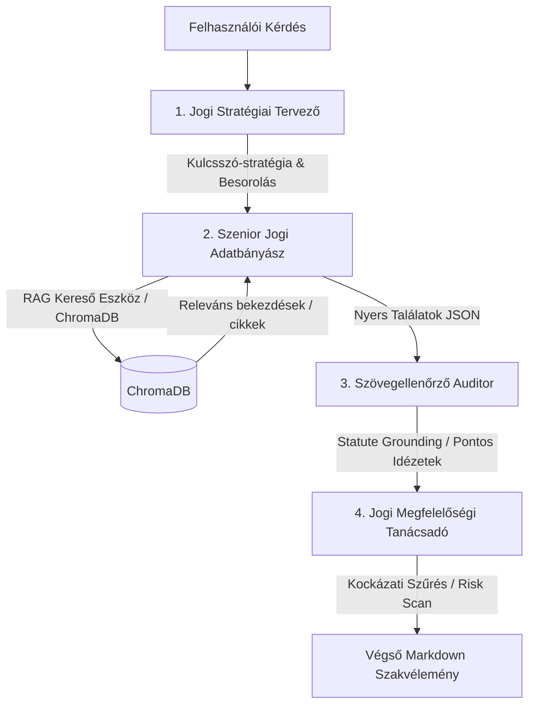

# ⚖️ JogiAgent Crew – Multi-Agent RAG Architektúra Magyar Jogi Dokumentumokhoz

[](https://www.python.org/)
[](https://crewai.com)
[](https://langchain.com)
[](https://www.trychroma.com/)

Ez a projekt egy autonóm, többágenses megközelítésre épülő, nagydimenziós szemantikus kereső és dokumentumelemző RAG (Retrieval-Augmented Generation) rendszer. A fejlesztés elsődleges célja komplex, strukturálatlan magyar jogi forrásszövegek feldolgozása, indexelése és kontextus-tudatos, rendkívül pontos megválaszolása.

A rendszer jelenleg az alábbi kiemelt magyar és európai uniós jogforrásokat támogatja:
*   **Polgári Törvénykönyv (Ptk.)** (`2013_V_PTK.pdf`)
*   **Személyi Jövedelemadó törvény (SZJA)** (`1995_CXVII_SZJA_TVK.pdf`)
*   **GDPR szabályozás (Általános Adatvédelmi Rendelet)** (`GDPR_2016.pdf`)
*   **Munka Törvénykönyve (Mt.)** (`edutax_mt2026_web.pdf`)

---

## 🏗️ Rendszerarchitektúra és Főbb Komponensek

A rendszer két fő pillérre épül: egy **egyedi jogi RAG pipeline**-ra és egy **többágenses kollaboratív Crew-architektúrára**.



### 1. Többágenses Koordináció (CrewAI keretrendszer)

A válaszadási folyamat elosztott intelligenciára épül. Négy specializált ágens működik együtt szigorú, egymásra épülő feladatsor mentén:

*   **Jogi Stratégiai Tervező és Kulcsszó-optimalizáló (`jogi_strategist`)**:
    *   **Szerep**: A felhasználói kérdés strukturális elemzése.
    *   **Feladat**: Azonosítja a releváns jogterületeket és a kérdés dogmatikai típusát (pl. definíció, hatálybeli korlátozás, kivétel). Olyan zajmentes kulcsszó-listát állít össze, amely minimalizálja az irreleváns találatokat (embedding drift).
*   **Szenior Jogi Adatbányász és RAG Specialista (`jogi_researcher`)**:
    *   **Szerep**: A RAG pipeline-ból történő adatkinyerés.
    *   **Feladat**: Futtatja a keresőeszközt és kigyűjti a legrelevánsabb jogszabályi helyeket. A kimenetet szigorú, változtatásmentes JSON formátumban adja tovább.
*   **Jogszabályi Megalapozottsági és Szövegellenőrző Auditor (`jogi_grounding_verifier`)**:
    *   **Szerep**: Precíz szövegellenőrzés (Statute Grounding).
    *   **Feladat**: Elemezi az adatbányász által átadott szövegeket, kiszűri a felesleges kontextuális zajt, és azonosítja a pontos bekezdéseket, alpontokat, valamint a szó szerinti, hitelesített idézeteket.
*   **Vezető Jogi Megfelelőségi Tanácsadó és Kockázatelemző (`jogi_advisor`)**:
    *   **Szerep**: Végső szakvélemény elkészítése és kockázatvizsgálat.
    *   **Feladat**: Hivatalos jogi szakvéleményt készít Markdown formátumban. Végrehajt egy **kockázati szűrést (Risk Scan)**: ellenőrzi a megfogalmazásokban az abszolút állításokat (pl. „mindig”, „soha”), összevetve azokat a jogszabályi kivételekkel.

### 2. Jogi Szövegekre Optimalizált RAG Pipeline (`src/rag.py`)

A jogi dokumentumok hagyományos beágyazása és darabolása gyakran elmossa a paragrafusok és cikkek határait. Emiatt a projekt egy **egyedi chunking pipeline**-t használ:
*   **Szemantikus Darabolás (Regex-alapú)**: A dokumentumokat a magyar jogszabályok szerkezetének megfelelően (pl. `12. cikk`, `45. §` vagy `152. §`) darabolja fel, így egy chunk pontosan egy jogi egységet fed le.
*   **Metaadat-kiterjesztés**: Minden egyes bejegyzéshez automatikusan társul a forrásdokumentum neve, a törvény pontos megnevezése, a cikk/paragrafus azonosítója, oldalszáma, valamint a beágyazási hasonlóság alapján számolt matematikai bizonyossági érték (confidence score).
*   **Lokális ChromaDB**: A beágyazott vektorok tárolása helyben történik koszinusz-hasonlósági metrika alapján történő visszakereséssel.
*   **Beágyazó Modell**: `models/gemini-embedding-001` (Google Generative AI).

---

## 📂 Projektstruktúra

```
jogi-agent/
├── chroma_db/               # A beágyazott jogi szövegek lokális vektoros adatbázisa
├── knowledge/               # Lokális tudásbázis elemek (user_preference.txt)
├── pdf/                     # A feldolgozott forrásdokumentumok (PTK, SZJA, GDPR, MT)
├── src/                     # A forráskódot tartalmazó főkönyvtár
│   ├── jogi_agent/          
│   │   ├── config/          # Az ágensek és feladatok YAML konfigurációs fájljai (agents.yaml, tasks.yaml)
│   │   ├── tools/           # Egyedi ágens-eszközök (custom_tool.py - a RAG kereső eszköz)
│   │   │   ├── __init__.py
│   │   │   └── custom_tool.py
│   │   ├── __init__.py
│   │   ├── crew.py          # Az ágensek és feladatok logikai összekapcsolása (CrewAI definíció)
│   │   ├── main.py          # **A Crew futtatásáért és CLI felületéért felelős belépési pont**
│   │   └── report.md        # Mentett kimeneti jelentés fájl
│   └── rag.py               # A RAG pipeline és a ChromaDB építésének/lekérdezésének implementációja
├── .env.example             # Környezeti változók sablonja az API integrációhoz
├── .gitignore               # Verziókezelésből kizárt fájlok listája
├── pyproject.toml           # Projekt metaadatok, függőségek és futtató scriptek definíciója
└── uv.lock                  # Az uv dependency manager zárolási fájlja
```

---

## ⚙️ Telepítés és Konfiguráció

### Előfeltételek
*   **Python**: `>= 3.10` és `< 3.14` közötti verzió.
*   **Csomagkezelő**: Javasolt az [Astral UV](https://docs.astral.sh/uv/) használata a rendkívül gyors függőségkezelés érdekében.

### 1. Függőségek telepítése

Ha még nincs telepítve a `uv` csomagkezelő:
```bash
pip install uv
```

Hozza létre a virtuális környezetet és szinkronizálja a függőségeket a `pyproject.toml` alapján:
```bash
# Projekt beállítása, virtuális környezet létrehozása és szinkronizálás:
uv sync

# Virtuális környezet aktiválása (opcionális, mert az `uv run` aktiválás nélkül is működik):
source .venv/bin/activate
```
Alternatívaként a CrewAI CLI segítségével is telepíthet:
```bash
crewai install
```

### 2. Környezeti változók beállítása

Másolja le a `.env.example` fájlt `.env` néven:
```bash
cp .env.example .env
```

Nyissa meg a `.env` fájlt, és adja meg a szükséges konfigurációkat:
```env
GOOGLE_API_KEY=az-on-api-kulcsa       # Google Gemini API kulcs a RAG-hoz és a modellekhez
MODEL=gemini/gemini-2.5-flash-lite    # Az LLM modell, amit a CrewAI használ
CREWAI_TRACING_ENABLED=false          # CrewAI nyomkövetés (igény szerint bekapcsolható)
```

---

## 🚀 Futtatás és Használat

A projekt futtatására több lehetőség is rendelkezésre áll a `pyproject.toml` fájlban definiált belépési pontoknak köszönhetően.

### 1. Interaktív Jogi Asszisztens indítása (CLI)

Ez az indítási mód egy interaktív konzolt nyit meg, ahol folyamatosan tehet fel kérdéseket az ügynököknek. A kilépéshez írja be a `break` szót.

**CrewAI paranccsal:**
```bash
crewai run
```

**Python szkript közvetlen meghívásával:**
```bash
python src/jogi_agent/main.py
```

**A `pyproject.toml` script meghívásával `uv`-n keresztül:**
```bash
uv run run_crew
```

### 2. Automatikus benchmark tesztelés

A rendszer tartalmaz egy előre beállított kérdéssort (GDPR, Mt. és Ptk. témakörökben), amivel tesztelhető a rendszer stabilitása és pontossága.

```bash
uv run test
```

---

## 🔍 Tesztkérdések Példák

A rendszer hatékonyságának tesztelésére az alábbi összetett kérdések használhatók:
1. *„Az adathordozhatósághoz való jog minden adatkezelési jogalap esetén érvényesül?”* (GDPR)
2. *„A munkavállaló hozzájárulása elegendő jogalap-e minden munkaviszonnyal kapcsolatos adatkezeléshez?”* (Mt. + GDPR interakció)
3. *„Az elfeledtetéshez való jog automatikusan alkalmazandó minden adatkezelés esetén?”* (Kivételek és jogalapok vizsgálata)

---

## 📄 Licenc
Ez a projekt oktatási és fejlesztési célokra készült. A visszakeresett jogi adatok tájékoztató jellegűek, és nem minősülnek hivatalos jogi tanácsadásnak.
